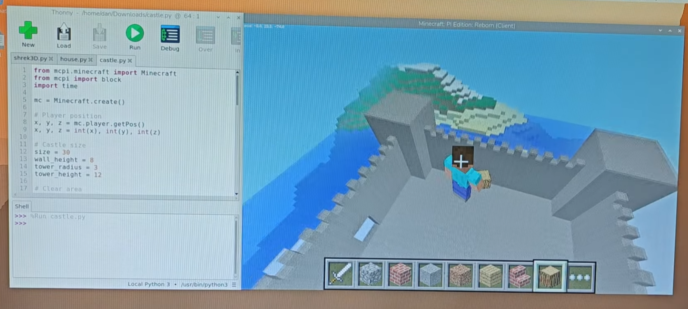

# 🐍 Minecraft Python Hacks (Raspberry Pi / MCPI)

Take your Raspberry Pi Minecraft world to the next level using Python! 💎
This project demonstrates how to use the `mcpi` library to instantly build structures, create fun effects, and add interactive elements to your world.

🎥 Based on the video:
https://www.youtube.com/watch?v=bA6ntWOwVjA

---

## 🚀 Overview

This repository contains a collection of Python scripts that showcase what’s possible once you’ve learned the basics of Minecraft Pi Edition (`mcpi`).

With just a few lines of code, you can:

* Instantly generate buildings 🏠
* Construct massive structures 🏰
* Create geometric builds 🔼
* Add interactive features 🎢
* Introduce chaotic (and funny) effects 🔥

---

## 🧠 What You'll Learn

* How to use the `mcpi` library to control the Minecraft world
* Working with coordinates and player position
* Using loops to generate large structures
* Automating builds with `setBlock` and `setBlocks`
* Adding creativity and interactivity through code

---

## 🛠️ Requirements

* Raspberry Pi (or compatible setup)
* Minecraft Reborn install video here: https://www.youtube.com/watch?v=SHi3jPus3LM
* Python 3
* `mcpi` library

---

## 📦 Setup

Full install guide here: https://www.youtube.com/watch?v=lP7CWBUp-Zw

## 🎮 Scripts Included

### 🏠 Instant House

Spawn a complete house instantly with one command.

---

### 🏰 Castle Builder

Create a large stone castle using loops and block placement.

---

### 🔼 Pyramid Generator

A classic coding challenge made simple.

---

### 🎢 Roller Coaster

Build a functional roller coaster in your world.

---

### 🔥 Lava Bum

Cause some chaos (and laughs).

---

## ⏱️ Video Breakdown

* `00:00` Introduction
* `00:09` Instant House
* `00:38` Castle Build
* `01:08` Pyramid Script
* `01:51` Additional Castle Code
* `02:12` Glass & Windows
* `02:47` Roller Coaster
* `03:25` Lava Bum

---

## 💡 Why This Project?

This project is perfect for:

* Beginners learning Python through Minecraft
* STEM education and classrooms
* Creative coding experimentation

---

## 🙌 Credits

Created by TeCoEd

---

## 📜 License

MIT License
